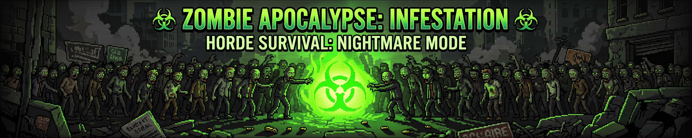

  <!-- BANNER ZUMBI PERSONALIZADO -->
  

    

  <!-- TYPING EFFECT TÓXICO -->
  

  

    
    <i>"I make my own luck... especially when the horde is at the door."</i>
    
  

### 🧟 DOSSIÊ DO SOBREVIVENTE

<table>
  <tr>
    <td width="65%">
      <ul>
        <li><b>Identidade:</b> <code>yniks</code></li>
        <li><b>Função:</b> Full-Stack Apocalypse Engineer</li>
        <li><b>Status Vital:</b> 🟢 Vivo (99% Imune a Infecção)</li>
        <li><b>Combustível:</b> ☕ Café e Energético Tóxico</li>
        <li><b>Missão de Campo:</b> Exterminar hordas de bugs no código antes do amanhecer.</li>
      </ul>
    </td>
    <td width="35%" align="center">
      
    </td>
  </tr>
</table>

### 🗡️ ARSENAL CONTRA A HORDA

#### ☣️ Armas Primárias & Secundárias

#### 🧰 Equipamentos de Búnker

### 📊 RADAR DE INFECTADOS & KILL COUNT

  
  

 

  

 

  

